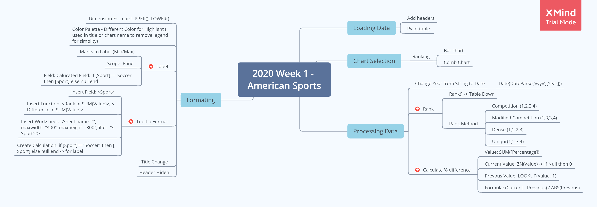
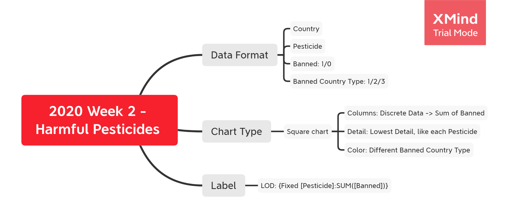
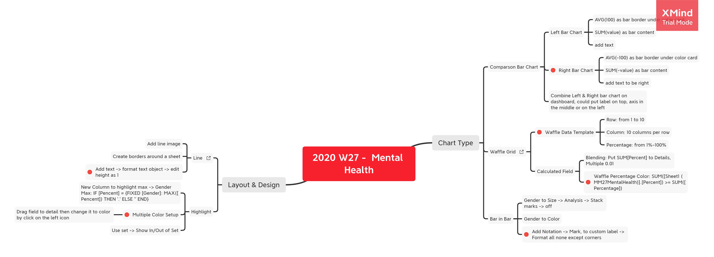

# Tableau Playground
This project is built to keep track of my tableau projects for upskilling myself.

### Tableau Specialist
This folder contains the materials and study notes for preparing my Tableau Specialist. 
I passed my Tableau Specialist exam for the first attempt and enjoyed the journey to improve my visualization and storytelling skills.

#### Useful Resources: 
* [Udemy Course](https://www.udemy.com/course/tableau-specialist-certification-prep/learn/)
* [eLearning](https://elearning.tableau.com/)
* [Tableau Public](https://public.tableau.com/en-us/s/)

### MakeOverMonday
Makeover Monday is a weekly online-public data analysis and visualisation project. 
This folder keeps tracks of my exercises and related study notes.

#### Useful Resources:
* [MakeOverMonday Project](https://www.makeovermonday.co.uk/)
* [MakeOverMonday Book](https://www.amazon.com.au/MakeoverMonday-Improving-Visualize-Analyze-Chart-ebook/dp/B07JDTZ63N)
* [Andy Kriebel's Blog](http://www.vizwiz.com/)
* [Andy Cotgreave's Blog](https://gravyanecdote.com/)
* [Eva Murryay's Blog](https://trimydata.com/author/trimydata/)

#### Weekly Favorites Study Ground
In order to keep practicing and learning from wonderful visualisations made by other amazing participants, I have summarized the related learning materials. 

All favorite designs are published on [MakeOverMonday Blog](https://www.makeovermonday.co.uk/blog/) each week. 

Materials folder will keep all the copies of favorites published on the [Tableau Public](https://public.tableau.com/s/) for studying. 

I also collect all the favorites to my Pinterest as [MakeOverMonday2020](https://pin.it/1d9Uxja) for inspiration.

| Session | Topic |  Study Note|
| ---- | ------ | --------| 
| 2020 Week1| What is America’s most popular sport?||
| 2020 Week2| Use of harmful pesticides in US agriculture||
| 2020 Week27| Comparing common mental disorder by sex ||

### StudyNote
This folder contains the study notes when I read through the following fantastic books for data analysis and visualization. 

#### Bookself:
* [The Big Book of Dashboards](https://www.amazon.com.au/Big-Book-Dashboards-Visualizing-Real-world/dp/1119282713)
* [Storytelling with Data](https://www.amazon.com.au/Storytelling-Data-Visualization-Business-Professionals/dp/1119002257/ref=pd_lpo_14_t_1/358-0748540-0097346?_encoding=UTF8&pd_rd_i=1119002257&pd_rd_r=fd23b93c-af90-48c4-bdc1-f1a99396dc1e&pd_rd_w=DR04V&pd_rd_wg=kbEtW&pf_rd_p=ad2d1e6e-bc60-4795-b4c0-2dbd35f6678d&pf_rd_r=WV4CVP0ZY66XM2E27453&psc=1&refRID=WV4CVP0ZY66XM2E27453)
* [Data Science for Business](https://www.amazon.com.au/Data-Science-Business-Data-Analytic-Thinking/dp/1449361323/ref=reads_cwrtbar_2/358-0748540-0097346?_encoding=UTF8&pd_rd_i=1449361323&pd_rd_r=935cd414-99b2-41db-abe1-231cb08a04d3&pd_rd_w=4xMGZ&pd_rd_wg=Er64H&pf_rd_p=179154b0-e028-4df7-8937-c07b49319319&pf_rd_r=VQ4VBCWP0KRJMA2YZTXT&psc=1&refRID=VQ4VBCWP0KRJMA2YZTXT)

### Credits
* [Mutoo](https://github.com/mutoo) - Wash dishes and take care of baby while I am programming :D
